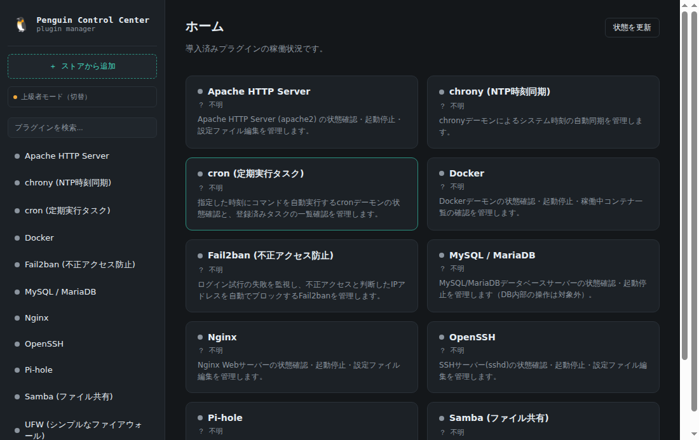
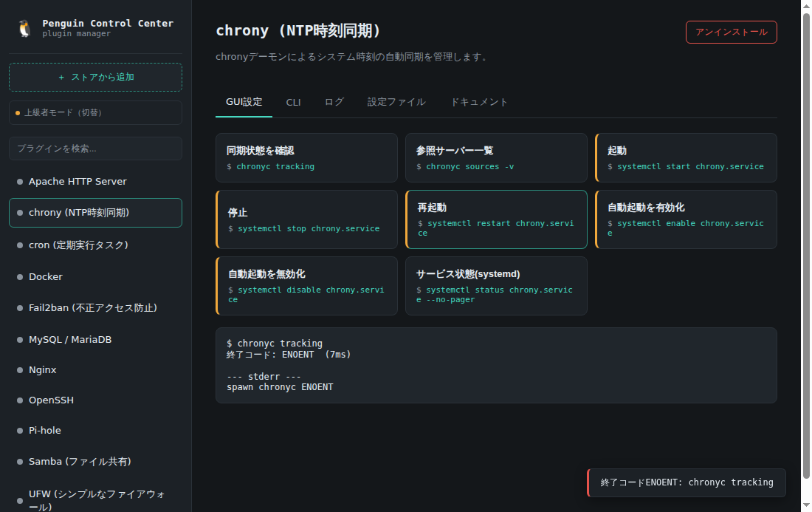
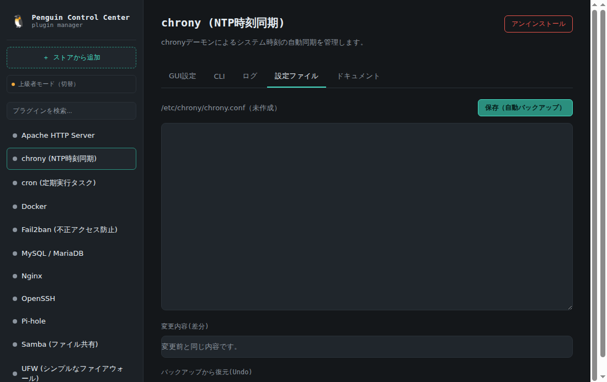

# Penguin Control Center (PCC)

LinuxのCLIツールをGUIで管理し、対応するCLIも同時に学べる統合管理ツール。
GUI操作のたびに対応するCLIコマンドが表示され、設定ファイルの差分表示・自動バックアップ・Undo、
プラグインストアからのワンクリック導入など、Linux管理と学習を一つにまとめています。

## スクリーンショット

| ホーム(ダッシュボード) | プラグイン操作(GUI↔CLI対応) | 設定ファイルの差分表示 |
|---|---|---|
|  |  |  |

## 動作環境

- Linux（systemd環境。journalctl・pkexecが利用可能なこと）
- Node.js 18以上
- `chrony` パッケージ（`sudo apt install chrony` 等。未インストールでもアプリ自体は起動します）

## インストール方法

### 方法A: 配布パッケージを使う（推奨・簡単）

[Releases](https://github.com/RT2231/penguin-control-center/releases)から、お使いの環境に合わせて
ダウンロードしてください。各リリースには`SHA256SUMS`も添付されているので、改ざん・破損がないか
確認できます。

```bash
sha256sum -c SHA256SUMS --ignore-missing
```

- **`.deb`（Debian/Ubuntu系）**: `sudo dpkg -i penguin-control-center_*.deb` でインストール後、
  アプリケーションメニューから起動できます
- **`.AppImage`（ディストリビューション非依存）**: ダウンロード後に実行権限を付与して直接起動
  ```bash
  chmod +x "Penguin Control Center-*.AppImage"
  ./Penguin\ Control\ Center-*.AppImage
  ```

### 方法B: ソースから起動する（開発・カスタマイズ向け）

```bash
git clone https://github.com/RT2231/penguin-control-center.git
cd penguin-control-center
npm install
npm start
```

## 自分でパッケージをビルドする

```bash
npm install
npm run dist            # deb + AppImage 両方
npm run dist:deb        # debのみ
npm run dist:appimage   # AppImageのみ
```

`release/`ディレクトリに成果物が生成されます。`vX.Y.Z`形式のタグをpushすると、GitHub Actionsが
自動でビルドし、対応するReleaseに添付します。

## 特権操作について

`起動` `停止` `再起動` `自動起動を有効化/無効化` は `pkexec` 経由で実行されます。
実行時にOSのパスワード認証ダイアログが表示されます（アプリ内にパスワードは保持しません）。
`pkexec` が使えない環境（PolicyKit未導入など）では失敗しますので、その場合はCLIタブに表示される
コマンドを手動で `sudo` 実行してください。

## 公式サイト・プラグインストア

- 公式サイト: https://rt2231.github.io/penguin-control-center/
- プラグインストア(Webページ): https://rt2231.github.io/penguin-control-center/store.html
  各プラグインの「詳細を見る」から、`docs.md`の内容（対応CLIコマンド・注意事項等）をWeb上でも確認できます。
- **アプリ内から直接導入**: アプリのサイドバー上部「＋ ストアから追加」を押すと、公式ストアのプラグイン一覧が表示され、
  「導入する」ボタン一つでダウンロード・展開・`plugins/`への配置まで自動で行われます（`unzip`コマンドが必要です）。
  ダウンロードしたzipはSHA256でカタログ記載のハッシュと照合し、一致しない場合はインストールを中止します。
- **アンインストール**: プラグイン画面右上の「アンインストール」ボタンから、確認ダイアログを経てその場で削除できます
  （管理対象ソフトウェア自体は削除されず、PCC上の管理用プラグインのみが削除されます）。
- **設定ファイルの差分表示・Undo**: 設定ファイルタブでは変更前との差分をリアルタイム表示し、過去のバックアップ一覧から
  ワンクリックで復元できます（復元前の状態も自動でバックアップされるため、Undoからのやり直しも可能です）。
- **初心者/上級者モード**: サイドバー上部のボタンで切り替え可能。初心者モードでは、最もリスクの高い「設定ファイル」タブが
  非表示になります（GUI操作・CLI表示・ログ・ドキュメントは両モードで利用可能）。設定はローカルに保存され、次回起動時も維持されます。
- **ホーム/ダッシュボード**: ブランドロゴをクリックするといつでも戻れます。導入済み全プラグインの稼働状況を一覧表示します。
  状態チェックの結果は5秒間キャッシュされ、画面遷移のたびに全プラグイン分のsystemctlが実行されるのを防ぎます
  （アクション実行直後や「状態を更新」ボタンでは必ず最新の状態を取得します）。
- **プラグイン検索**: サイドバーの検索ボックスで導入済みプラグインを名前で絞り込めます。ストア画面ではタグでの絞り込みも可能です。
- **トースト通知**: アクション実行・導入・保存・復元などの結果を、画面右下の通知でも確認できます（他のタブを見ていても見逃しにくくなります）。
- **プラグイン競合検知**: `plugin.json`に`conflictsWith`を宣言しておくと、競合するプラグイン（例: ApacheとNginx、
  どちらも80/443番ポートを使用）が同時に稼働している状態でサービスを起動しようとした際に警告ダイアログを表示します。
- **更新チェック・まとめて更新**: ホーム画面で導入済みプラグインに更新があると「⬆ 更新あり」バッジが表示され、
  「まとめて更新」ボタンで一括更新できます。
- **自動アップデート**: AppImage版として実行している場合、起動時にGitHub Releasesを確認し、新しいバージョンが
  あれば通知します（ダウンロード・インストールともにユーザーの明示的な同意が必要）。`.deb`版は対象外です
  （パッケージマネージャでの更新を想定）。

## パッケージについて(配布物はプラグインを含まない)

配布される`.deb`/`AppImage`には、**プラグインは一切含まれていません**（ゼロの状態で配布されます）。
これは意図的な設計です。

- パッケージ化されたアプリのインストール先は読み取り専用領域のため、そこにストアからの
  プラグインを書き込むことができません
- そのため、プラグインの保存先はユーザーごとの書き込み可能領域（`~/.config/penguin-control-center/plugins/`相当）
  に分離されており、初回起動時は空の状態で、アプリ内の「＋ ストアから追加」から導入する設計になっています
- 開発中(`npm start`)は、これまで通りリポジトリ内の`plugins/`フォルダがそのまま使われます（動作確認用）

対応してほしいソフトウェアがある場合は、[プラグイン提案Issue](https://github.com/RT2231/penguin-control-center/issues/new?template=plugin-proposal.md)から提案してください（公式が審査のうえストアに掲載します）。

## プラグインをストアに公開する（メンテナ向け）

`plugins/`にプラグインを追加・更新したら、GUIツールでストア（`docs/catalog.json` + `docs/downloads/*.zip`）に反映できます。

```bash
npm run publish-gui
# → http://localhost:5178 をブラウザで開く
```

プラグイン一覧から「ストアに公開」を押すと、そのプラグインをzip化して`docs/downloads/`に置き、
`docs/catalog.json`にエントリを追加・更新します。Gitへのコミット・pushは自動で行われないので、
画面に表示されるコマンドで確認しながら手動で行ってください。

## 自動テスト（開発者向け）

コア機能（プラグイン読み込み・設定ファイルのバックアップ/復元・差分計算・CLI実行・
ストアのセキュリティ検証ロジック）はNode標準の`node:test`で単体テストしています。

```bash
npm test
```

加えて、CIでは実際に`xvfb`上でElectronアプリを起動し、preloadエラーや未捕捉例外が
出ていないか・プラグイン一覧が実際に描画されているかを確認する**スモークテスト**も実行しています
（構文チェックや単体テストだけでは検出できない、「Electronとして実際に動くか」を検証するためです）。

```bash
PCC_SMOKE_TEST=1 xvfb-run -a npx electron . --no-sandbox
```

CIでもpushのたびに自動実行されます。

## 新しいプラグインの追加方法（開発者向け）

`plugins/<プラグイン名>/plugin.json` を作成するだけで、GUIに新しいソフトウェアが追加されます。

```jsonc
{
  "id": "openssh",
  "name": "OpenSSH",
  "version": "0.1.0",
  "description": "...",
  "service": {
    "systemdUnit": "ssh.service",
    "configPath": "/etc/ssh/sshd_config"
  },
  "actions": [
    { "id": "status", "label": "状態確認", "cli": ["systemctl", "status", "ssh.service", "--no-pager"], "privileged": false },
    { "id": "restart", "label": "再起動", "cli": ["systemctl", "restart", "ssh.service"], "privileged": true }
  ],
  "docs": "docs.md"
}
```

同ディレクトリに `docs.md` を置けばドキュメントタブに、複雑な処理が必要なら `handler.js` を
置けば任意のJSロジックを追加できます（詳細は `DESIGN.md` の「プラグインマニフェスト仕様」を参照）。

## 既知の制約（MVPのため）

- プラグインの更新チェックは手動（ストア画面を開いたときのみ確認、バックグラウンド自動更新なし）
- 設定ファイルの構文チェックは未実装（差分表示・バックアップ・Undoは実装済み）
- Ubuntu/Debian系での動作を主に想定（他ディストリビューションは`systemdUnit`名の差異等で調整が必要な場合あり）
- `handler.js`はメインプロセスで無制限に実行されるため、実質的にフル権限のコードとして扱われます（ストアでは`⚠ カスタムコード含む`バッジで明示）

詳細な設計方針・今後のロードマップは `DESIGN.md` を参照してください。

## ライセンス

- **本体**（`main.js`, `preload.js`, `core/`, `renderer/`, `tools/`等）: [GPL-3.0](./LICENSE)
  （プラグイン向けの追加的許可条項付き。詳細は`LICENSE`ファイル末尾を参照）
- **`plugins/`配下の公式プラグイン**: [MIT](./plugins/LICENSE)

本体をGPL-3.0としているのは、クローズドソース化された改変版が無断で販売されることを防ぐためです。
一方でプラグインは、GPLv3第7条に基づく追加的許可により、本体のコピーレフトに縛られず
（本体の`require()`で読み込まれる形であっても）自由なライセンスで公開できます。
これにより「本体は保護しつつ、プラグインエコシステムは寛容ライセンスで育てやすくする」
両立を図っています。
